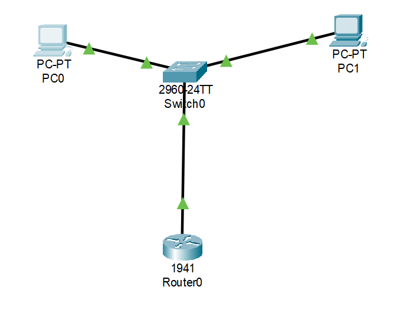
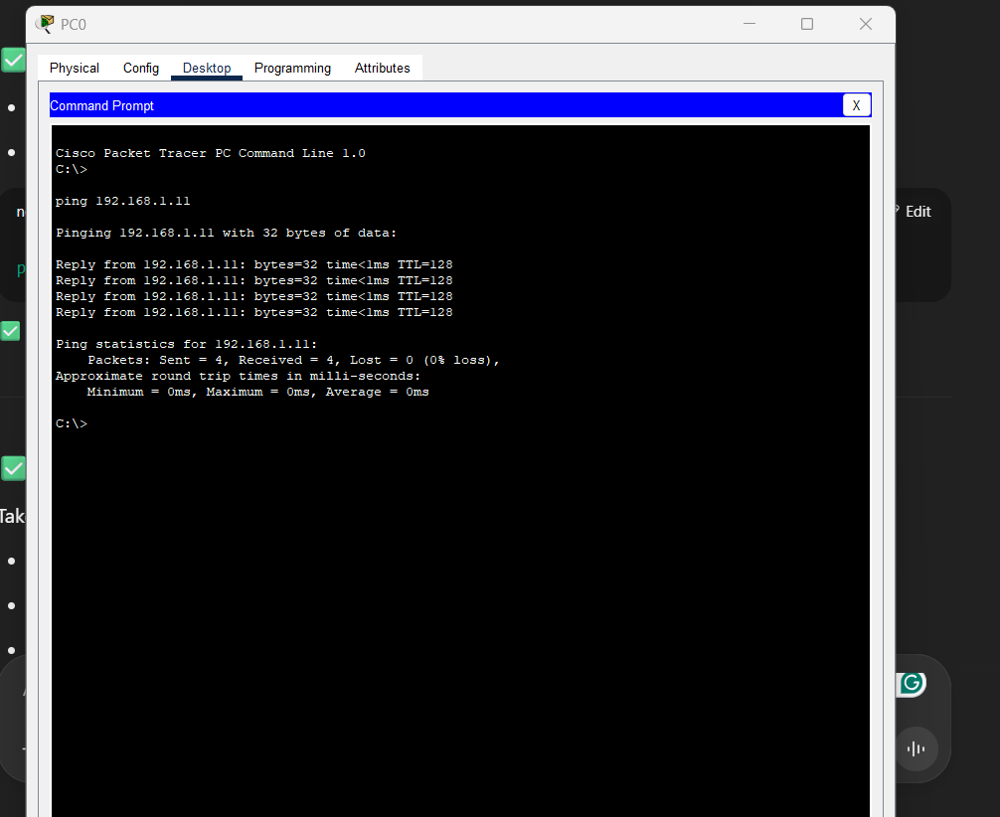

# Basic-Network-Lab-Packet-Tracer

## Overview
This is a simple networking lab I built in Cisco Packet Tracer to practice basic setup and connectivity.  
I connected two PCs to a switch, and the switch uplinks to a single router interface.  
After assigning IP addresses and configuring the router, I tested communication between the two PCs with a ping.

---

## Topology
Here’s the overall layout of the network:

---

## PC Configurations

**PC0**  
IP Address: `192.168.1.10`  
Subnet Mask: `255.255.255.0`  
Default Gateway: `192.168.1.1`

---

**PC1**  
IP Address: `192.168.1.11`  
Subnet Mask: `255.255.255.0`  
Default Gateway: `192.168.1.1`

---

## Router Configuration
Below are the commands I used to configure the router interface and bring it up:
enable
configure terminal
interface gigabitEthernet0/0
ip address 192.168.1.1 255.255.255.0
no shutdown
end
write
Here’s the CLI output after running those commands:

---

## Test Results
Ping from PC0 to PC1 confirmed successful communication with 0% packet loss:

---

## What I Learned
- How to assign static IPs to PCs in Packet Tracer.
- How to configure a router interface with an IP address and enable it.
- How to test network connectivity using `ping`.

---

**Packet Tracer File:**  
You can download and open this lab in Packet Tracer: [Basic Network.pkt](Basic%20Network.pkt)
