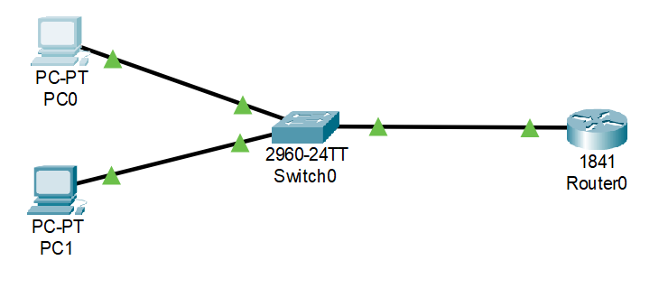
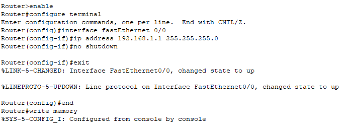
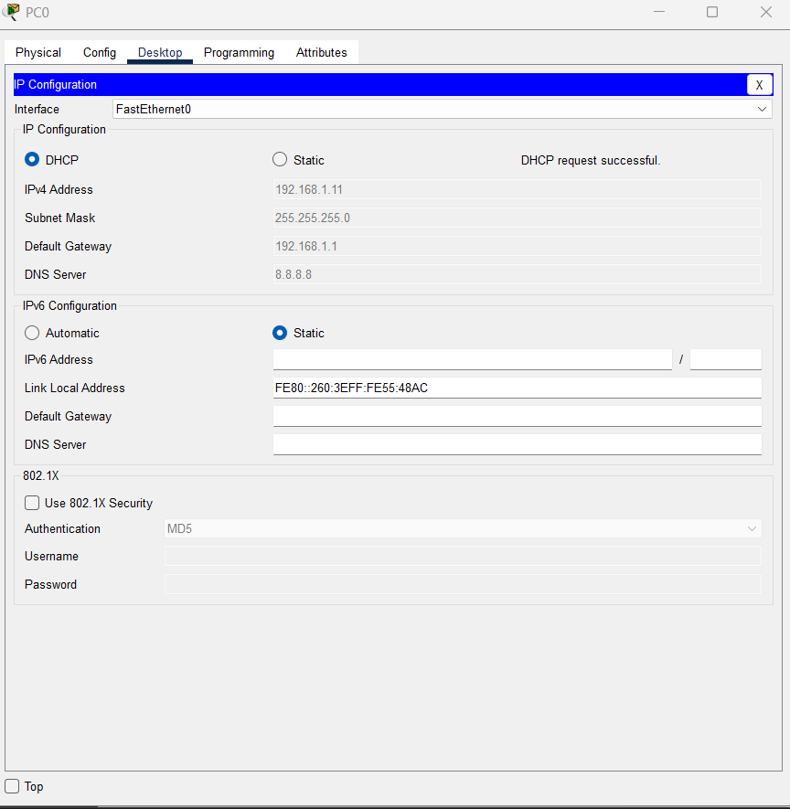
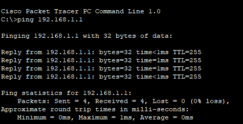
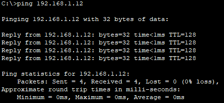

# DHCP Configuration Lab – Packet Tracer

## 📖 Overview
This lab demonstrates how to configure a Cisco router to act as a DHCP server for a small network.  
In many real-world environments, end-user devices get their IP configuration automatically.  
By completing this lab, I’ve shown that I can:
- Configure a router interface,
- Set up and manage a DHCP pool,
- Verify that end devices receive valid IP addresses,
- Troubleshoot and test connectivity.

---

## 🖥️ Topology


**Devices used:**
- 🖧 Cisco 2960 Switch  
- 📡 Cisco 1841 Router  
- 💻 2 PCs (PC0, PC1)

**Why:** This simulates a simple office network where all devices connect through a switch to a single router that handles IP address management.

---

## ⚙️ Configuration Steps

### 1. Configure the Router Interface
We assign an IP address to the router’s internal interface so it can act as the default gateway for the network.

```plaintext
enable
configure terminal
interface fastEthernet 0/0
ip address 192.168.1.1 255.255.255.0
no shutdown
exit
end
write memory
```
✅ *Interface configured successfully:*  


---

### 2. Configure the DHCP Service on the Router
We create a DHCP pool so the router can automatically assign IP addresses to devices.  
We also exclude certain addresses (like the router’s own IP) so they aren’t handed out to clients.

```plaintext
configure terminal
ip dhcp pool LAB
 network 192.168.1.0 255.255.255.0
 default-router 192.168.1.1
 dns-server 8.8.8.8
exit
ip dhcp excluded-address 192.168.1.1 192.168.1.10
end
write memory
```
✅ *DHCP pool configured successfully:*  


---

### 3. Configure PCs to Obtain IP via DHCP
On each PC, go to **Desktop > IP Configuration** and select **DHCP**.  
The PC should receive an IP address, subnet mask, gateway, and DNS from the router automatically.

✅ *Example from PC0:*  


---

### 4. Test Connectivity
We test by pinging from each PC to the router and between PCs.  
Successful pings show that:
- The router’s DHCP pool is working,
- Both PCs are on the same network,
- The router is functioning as the default gateway.

✅ *Ping from PC0 to Router:*  


✅ *Ping from PC0 to another PC:*  


---

## 📥 Download the Packet Tracer File
[**➡️ Download DHCP Configuration Lab**](./DHCP%20Configuration%20Lab.pkt)

---

✅ **What this demonstrates:**  
I can set up dynamic IP address management in a simulated network environment, verify connectivity, and document the entire process — a skill directly applicable to troubleshooting and configuring networks in an entry-level IT or help desk role.
