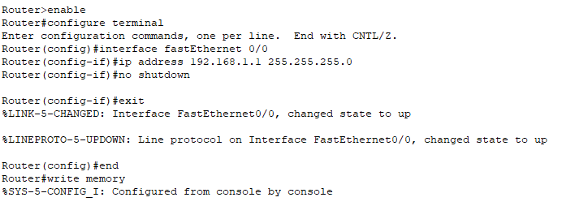
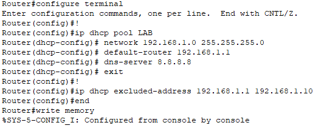
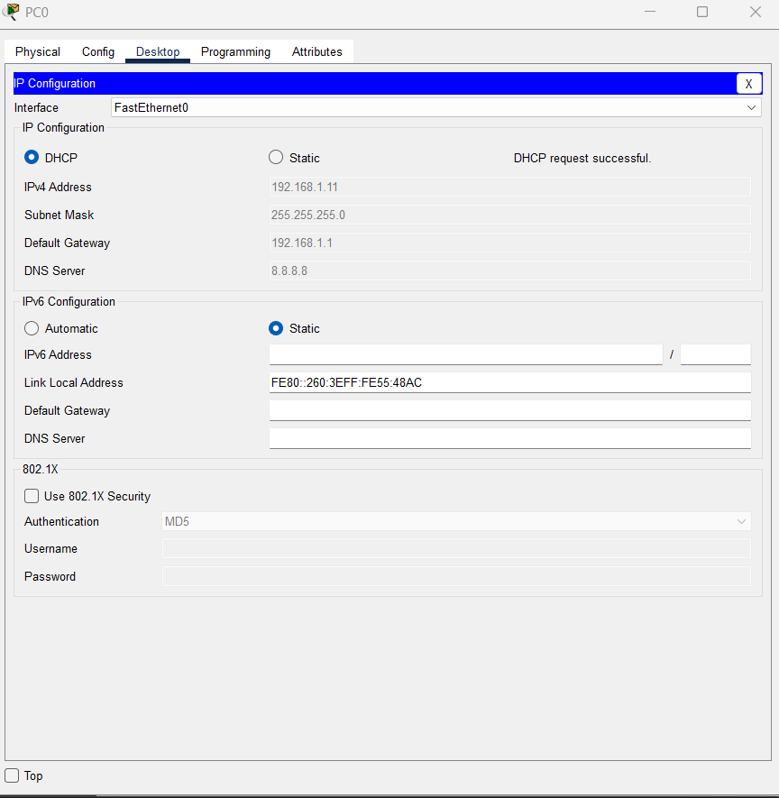
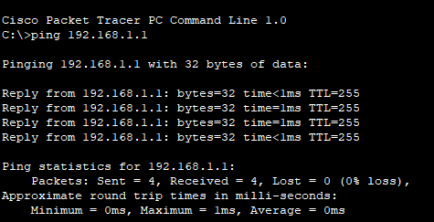
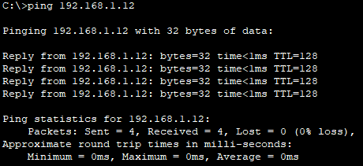

# DHCP Configuration Lab – Packet Tracer

## 📖 Overview
This lab demonstrates how to configure a Cisco router to act as a DHCP server for a network.  
A router provides IP addresses to PCs automatically, along with a subnet mask, default gateway, and DNS server.

---

## 🖥️ Topology


**Devices used:**
- 🖧 Cisco 2960 Switch  
- 📡 Cisco 1841 Router  
- 💻 2 PCs (PC0, PC1)

---

## ⚙️ Configuration Steps

### 1. Configure the Router Interface
On the router, enter global configuration mode and set up the interface:
```plaintext
enable
configure terminal
interface fastEthernet 0/0
ip address 192.168.1.1 255.255.255.0
no shutdown
exit
end
write memory
```
✅ Interface configured successfully:  


---

### 2. Configure the DHCP Service on the Router
Create a DHCP pool, specify the network, default gateway, DNS server, and exclude a range of addresses:
```plaintext
configure terminal
ip dhcp pool LAB
 network 192.168.1.0 255.255.255.0
 default-router 192.168.1.1
 dns-server 8.8.8.8
exit
ip dhcp excluded-address 192.168.1.1 192.168.1.10
end
write memory
```
✅ DHCP pool configured successfully:  


---

### 3. Configure PCs to Obtain IP via DHCP
On each PC, go to **Desktop > IP Configuration** and select **DHCP**.  
The PC should receive an IP address from the router.

✅ Example from PC0:  


---

### 4. Test Connectivity
Ping from each PC to the router and between PCs to verify they are getting valid addresses and can communicate.

✅ Ping from PC0 to Router:  


✅ Ping from PC0 to another PC:  


---

## 📥 Download the Packet Tracer File
[**➡️ Download DHCP Configuration Lab**](./DHCP%20Configuration%20Lab.pkt)

✅ **Lab complete!** Your router is now successfully configured as a DHCP server.
