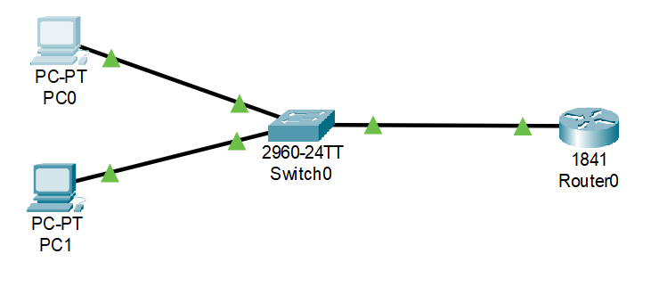

# Inter‑VLAN Routing – Packet Tracer

## Overview
This lab demonstrates how to configure inter‑VLAN routing on a single router (Router‑on‑a‑Stick).  
Two VLANs are created on a switch, PCs are assigned to those VLANs, and subinterfaces are configured on the router to enable communication between VLANs.

---

## Topology


**Devices used:**
- 1 Cisco 2960 Switch  
- 1 Cisco 1841 Router  
- 4 PCs (PC0, PC1, PC2, PC3)

---

## VLANs and IP Plan

| VLAN | Name   | Ports    | Subnet         | Default Gateway |
|------|--------|----------|----------------|-----------------|
| 10   | VLAN10 | Fa0/1‑2  | 192.168.10.0   | 192.168.10.1    |
| 20   | VLAN20 | Fa0/3‑4  | 192.168.20.0   | 192.168.20.1    |

---

## Step 1: Create VLANs on the switch
```
enable
configure terminal
vlan 10
name VLAN10
exit
vlan 20
name VLAN20
exit
```


---

## Step 2: Assign ports to VLANs
```
interface range fa0/1-2
switchport mode access
switchport access vlan 10
exit

interface range fa0/3-4
switchport mode access
switchport access vlan 20
exit
```


---

## Step 3: Configure trunk port on the switch
```
interface fa0/24
switchport mode trunk
exit
```


---

## Step 4: Configure the router interface
```
enable
configure terminal
interface fa0/0
no shutdown
exit
```


---

## Step 5: Create subinterfaces on the router for each VLAN
```
interface fa0/0.10
encapsulation dot1Q 10
ip address 192.168.10.1 255.255.255.0
exit
```


```
interface fa0/0.20
encapsulation dot1Q 20
ip address 192.168.20.1 255.255.255.0
exit
```


---

## Step 6: PC IP Configurations
Configure each PC with the following static settings:

**PC0:**  
IP: 192.168.10.10  
Subnet: 255.255.255.0  
Default Gateway: 192.168.10.1  

**PC1:**  
IP: 192.168.10.11  
Subnet: 255.255.255.0  
Default Gateway: 192.168.10.1  

**PC2:**  
IP: 192.168.20.10  
Subnet: 255.255.255.0  
Default Gateway: 192.168.20.1  

**PC3:**  
IP: 192.168.20.11  
Subnet: 255.255.255.0  
Default Gateway: 192.168.20.1  

---

## Step 7: Testing Connectivity

**Ping from PC0 to PC1 (same VLAN)**  


**Ping from PC0 to PC2 (different VLAN)**  


**Ping from PC0 to PC3 (different VLAN)**  


---

✅ **All tests show successful replies, confirming inter‑VLAN routing is working.**
