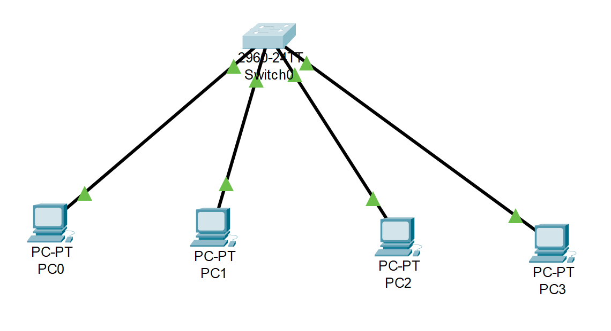

# VLAN Lab – Packet Tracer

## Overview
This lab demonstrates creating and testing VLANs on a Cisco 2960 switch.  
Two VLANs were configured:
- **VLAN 10:** PC0 and PC1
- **VLAN 20:** PC2 and PC3

PCs in the same VLAN can communicate successfully, while PCs in different VLANs cannot communicate without routing.

---

## Topology

---

## IP Configuration
| Device | VLAN | IP Address | Subnet Mask |
|--------|------|------------|-------------|
| PC0 | VLAN 10 | 192.168.10.10 | 255.255.255.0 |
| PC1 | VLAN 10 | 192.168.10.11 | 255.255.255.0 |
| PC2 | VLAN 20 | 192.168.20.10 | 255.255.255.0 |
| PC3 | VLAN 20 | 192.168.20.11 | 255.255.255.0 |

**PC Screenshots:**
- 
- 
- 
- 

---

## Switch Configuration
### VLAN Creation

### Assign Ports
- Ports `Fa0/1-2` → VLAN 10  

- Ports `Fa0/3-4` → VLAN 20  

---

## Test Results
✅ PC0 → PC1 (same VLAN): Successful  
✅ PC2 → PC3 (same VLAN): Successful  
❌ PC0 → PC2 (different VLANs): Fails as expected  

**Ping Results:**
- 
- 
- 

---

## Packet Tracer File
[Download VLAN-Lab.pkt](VLAN-Lab.pkt)

---
*Created as part of my networking portfolio in Cisco Packet Tracer.*
